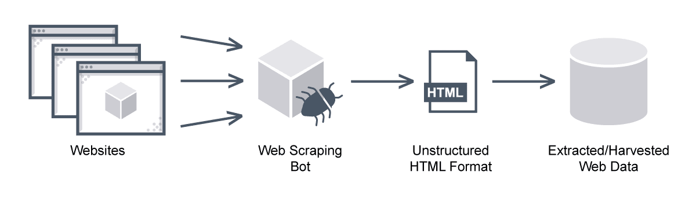


# Web Scraper Case Study (C#/.NET)
This web scraper project, developed in C# and .NET, has a dual-purpose: to provide a hands-on learning experience for the syntax of C# and XPath and to demonstrate the implementation of configuration and logging in a C# console application.

## Table of Contents

- [Introduction](#introduction)
- [Goals](#goals)
- [Features](#features)
- [Getting Started](#getting-started)
  - [Prerequisites](#prerequisites)
  - [Installation](#installation)
- [Usage](#usage)
- [Configuration](#configuration)
- [Disclaimer](#disclaimer)

## Introduction

This is a web scraper project developed in C# and .NET, designed to help you extract valuable data from websites. Whether you're collecting information for research, monitoring changes, or simply automating data collection, this web scraper provides a robust solution.

The scraper is built on the .NET framework, taking advantage of the powerful C# programming language to provide a versatile and customizable scraping tool. It uses libraries such as [Html Agility Pack (HAP)] to enhance the scraping capabilities.

## Goals  
- **Learning C# Syntax:** Dive into the world of C# and master its syntax, including variables, data types, loops, conditional statements, functions, and more. Through this project, you'll gain practical experience in C# programming, an essential language for various software development tasks.

- **XPath for Data Extraction:** Explore XPath, a powerful language used for navigating and extracting data from XML and HTML documents. With hands-on practice, you will understand how to use XPath to pinpoint specific elements within web pages, making web scraping an efficient and targeted process.

- **DOM (Document Object Model) Manipulation:** Understand how to interact with web page structures through the DOM. This project provides opportunities to manipulate the DOM tree, enabling you to extract, modify, or interact with web page content programmatically.

## Features

- **Robust HTML Parsing:** Utilize the HTML agility pack to parse and navigate through web page content.
- **Concurrency:** Perform multiple web requests concurrently to speed up the scraping process.
- **Error Handling:** Handle errors gracefully and log them for debugging and analysis.

## Getting Started

To start using the web scraper, follow these steps:

### Prerequisites

Before running the scraper, make sure you have the following prerequisites installed:

- Visual Studio 2022
- Git
- You need these NuGet Packages 
	> HtmlAgilityPack  
	> Microsoft.Extensions.Hosting  
	> Serilog.Extensions.Hosting  
	> Serilog.Settings.Configuration  
	> Serilog.Sinks.Console  

### Installation

1. Create a C# Console Project in Visual Studio 2022

2. Clone this Repository:

   ```sh
   git clone https://github.com/arashalghasi/WebCrawler.git 
   ```  

3. Make sure the file property of appsettings.json file must be  :   
__Copy to Output Directroy -> Copy always__
   

## Configuration

```json
<Project Sdk="Microsoft.NET.Sdk">

  <PropertyGroup>
	<OutputType>Exe</OutputType>
	<TargetFramework>net7.0</TargetFramework>
	<ImplicitUsings>enable</ImplicitUsings>
	<Nullable>enable</Nullable>
  </PropertyGroup>

  <ItemGroup>
	 <PackageReference Include="HtmlAgilityPack" Version="1.11.54" />
	<PackageReference Include="Microsoft.Extensions.Hosting" Version="7.0.1" />
	<PackageReference Include="Serilog.Extensions.Hosting" Version="7.0.0" />
	<PackageReference Include="Serilog.Settings.Configuration" Version="7.0.1" />
	<PackageReference Include="Serilog.Sinks.Console" Version="4.1.0" />
  </ItemGroup>

  <ItemGroup>
	<None Update="appsettings.json">
	  <CopyToOutputDirectory>Always</CopyToOutputDirectory>
	</None>
  </ItemGroup>

</Project>
```


## Usage
For students and educators in computer science and programming-related disciplines. It can be employed for learning and teaching purposes, helping students grasp the intricate concepts of programming language design and interpretation.

## Disclaimer
This web scraper project is intended to be a tool for educational purposes, as well as a means to automate data extraction from websites for legitimate and ethical reasons. 

Please be aware that the misuse of web scraping can result in legal consequences and damage to your reputation. This disclaimer serves as a reminder to use this tool responsibly and with the utmost respect for the rights, privacy, and expectations of website owners and users. The developer of this project are not responsible for any misuse or unlawful activities conducted with the web scraper.